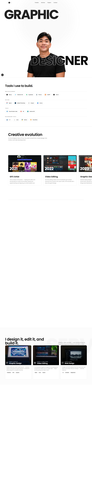
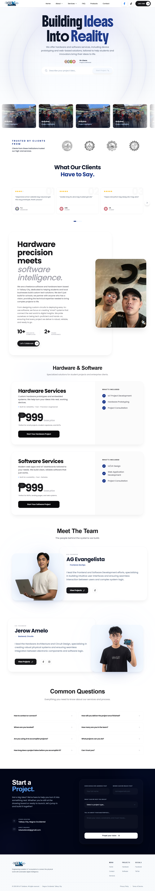
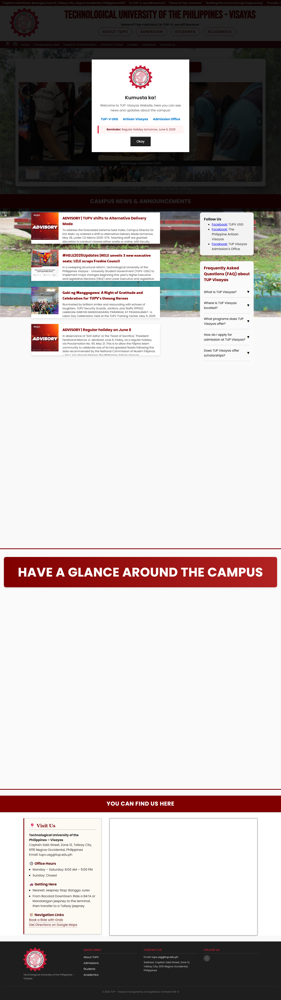
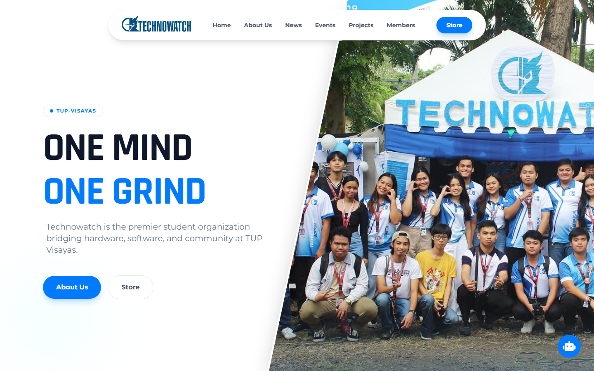

# Personal Projects

### Full-stack products, interface experiments, and practical systems

A curated portfolio of web applications, dashboards, institutional platforms, and product concepts built around thoughtful UX and real-world problems.

**Last updated: June 20, 2026**

[Explore Projects](#selected-work) · [Technology](#technology) · [Repository Notes](#repository-notes)

---

## About This Collection

This repository documents my growth as a developer through production-oriented systems, commissioned work, technical experiments, and design explorations. The projects span content management, emergency response, creator tools, institutional websites, e-commerce, and IoT services.

Some projects remain actively developed, while others are preserved as snapshots of earlier ideas and lessons learned.

## Selected Work

| Project | Focus | Status | Links |
| --- | --- | :---: | --- |
| **Portfolio** | Personal brand and content management | Active | [Source](my-portfolio/) · [Live Demo](https://12valor.vercel.app/) |
| **8K IoT** | Hardware and software services platform | Active | [Source](8k-iot-solutions/) · [Live Demo](https://8k-iot-solutions.vercel.app/) |
| **RSSI System** | Emergency response and field operations | Active | [Source](RSSI/) |
| **CreatorLens** | YouTube creator analytics and AI tools | Prototype | [Source](creator-lens/) |
| **CRITIQUE** | Structured creator feedback platform | Prototype | [Source](critique/) |
| **TUPV** | University information portal | Completed | [Source](TUPV%20Website/) |
| **Technowatch** | Student organization website | Prototype | [Source](Technowatch%20Website/) |
| **Flow** | Natural products marketplace | Completed | [Source](flow/) |
| **Retrieve** | Lost-and-found management system | Commission | [Source](lost%20and%20found%20commision/) |

---

## Live & Evolving

### Portfolio

A full-stack personal portfolio that doubles as a custom content management system. It provides a polished public experience alongside a secure admin workflow for managing projects, media, technology entries, and inquiries.

**Highlights**

- Secure server-side admin authentication and content management
- Dynamic project, media, and inquiry workflows
- Cloudinary-powered asset handling and optimized delivery
- Motion-rich interface with responsive layouts and interactive sections

**Stack:** Next.js · React · TypeScript · Tailwind CSS · PostgreSQL · Prisma · Cloudinary

[View source](my-portfolio/) · [Open live demo](https://12valor.vercel.app/)

---

### 8K IoT

A service platform for students, makers, and innovators seeking custom hardware, IoT, and software solutions. The platform combines a strong marketing experience with project, product, testimonial, and inquiry management.

**Highlights**

- Hardware prototyping and software service presentation
- Secure administration for projects, products, teams, and homepage content
- Dynamic inquiry handling and transactional email workflows
- Smooth GSAP, Framer Motion, and Lenis-powered interactions

**Stack:** Next.js · React · TypeScript · Tailwind CSS · Prisma · PostgreSQL · Supabase · Vercel

[View source](8k-iot-solutions/) · [Open live demo](https://8k-iot-solutions.vercel.app/)

---

### RSSI System

An emergency reporting and operations dashboard designed for Philippine disaster response teams. It brings incident visibility, mapping, alerts, evacuation information, and operational data into one focused interface.

**Highlights**

- Real-time emergency reports and high-visibility incident alerts
- Interactive mapping and evacuation-center tracking
- Weather-aware field operations dashboard
- SMS broadcast workflows for rapid public communication

**Stack:** Next.js · React · TypeScript · Tailwind CSS · Supabase · Leaflet · Nivo

[View source](RSSI/)

---

## Product Experiments

### CreatorLens

An analytics and productivity workspace for YouTube creators. CreatorLens explores how channel data and AI-assisted tools can turn performance signals into practical content decisions.

**Highlights**

- Channel growth and content-performance analytics
- AI-assisted content, transcript, and optimization tools
- Visual reporting for views, engagement, and publishing patterns
- Creator-focused workspace with secure account access

**Stack:** Next.js · React · TypeScript · Tailwind CSS · NextAuth · YouTube API · OpenAI

[View source](creator-lens/)

---

### CRITIQUE

A creator-first feedback platform built around useful critique rather than vanity metrics. Structured requests, threaded discussions, and first-impression reviews help creators ask better questions and receive more actionable responses.

**Highlights**

- Feedback requests organized by specific creative goals
- Threaded discussions and review workflows
- Blind first-impression mode for less biased feedback
- Authentication and persistent user-generated content

**Stack:** Next.js · React · TypeScript · Tailwind CSS · Supabase · Recharts

[View source](critique/)

---

## Institutional & Community

### TUPV

An institutional portal concept for the Technological University of the Philippines – Visayas. It organizes campus information, admissions guidance, academic resources, and student content into a more accessible web experience.

**Highlights**

- Centralized campus announcements, events, and information
- Admissions, academics, and student-resource sections
- Department and organization pages
- Responsive layouts for desktop and mobile visitors

**Stack:** HTML · CSS · JavaScript

[View source](TUPV%20Website/)

---

### Technowatch

A modern website prototype for a student technology organization. The concept focuses on strong visual hierarchy, institutional identity, project showcases, news, and community engagement.

**Highlights**

- Editorial landing page with organization branding
- News, event, member, project, and merchandise sections
- Responsive layouts and animated visual elements
- Clear pathways for students to discover and participate

**Stack:** HTML · Tailwind CSS · JavaScript

[View source](Technowatch%20Website/)

---

## Commerce & Client Work

### Flow

A nature-inspired marketplace concept for organic and sustainable products. Flow explores clean commerce UX through product discovery, filtering, cart behavior, and a streamlined checkout journey.

**Highlights**

- Minimal, product-focused storefront design
- Category browsing and inventory filtering
- Persistent cart and checkout interactions
- Responsive shopping experience

[View source](flow/)

---

### Retrieve

**Commissioned lost-and-found management system**

Retrieve is a practical web application for reporting, searching, matching, and claiming lost items. It was developed as commissioned work and is included here to demonstrate workflow design and applied problem solving.

**Highlights**

- Lost and found item reporting
- Search and category filtering
- Claim verification and status tracking
- Local-server deployment workflow

**Stack:** HTML · CSS · JavaScript

[View source](lost%20and%20found%20commision/)

> **License note:** Retrieve is proprietary commissioned work and is not covered by this repository's MIT license.

---

## Technology

### Frontend

### Data & Services

### Workflow

---

## Repository Notes

- Projects are organized as independent applications or static website folders.
- Some projects require their own environment variables and local service configuration.
- Screenshot assets represent each project's MVP or landing-page viewport.
- Archived projects are retained for learning history, design reference, and technical exploration.

## License

Unless a project states otherwise, this repository is available under the [MIT License](LICENSE). Commissioned or proprietary projects retain their individual restrictions.

---

Built through iteration, curiosity, and a steady appetite for solving useful problems.

